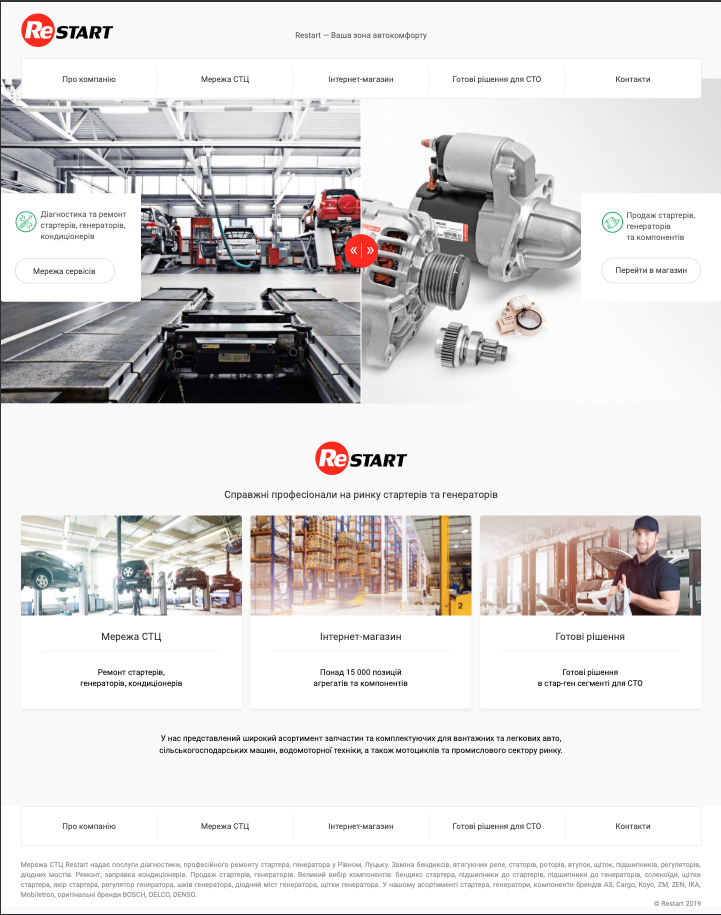

# Restart - Auto Comfort and Technical Service


## About
Restart is a professional platform that offers comprehensive services for the diagnostics, repair, and sale of car parts. The company specializes in the repair of starters, generators, and air conditioners, and also provides a wide selection of original spare parts through its online store.

## 🚀 Technologies Used
- **Gulp** (used during development) - Task runner for automating workflows.
- **SCSS** - Preprocessor for enhanced and modular styles.
- **BEM (Block Element Modifier)** - Naming convention for scalable and maintainable CSS.
- **JavaScript** - For interactive elements.
- **HTML5 & CSS3** - Core web technologies for structuring and styling.

## 📂 Project Structure
```
├── css/            # Compiled CSS files
├── fonts/          # Custom fonts
├── img/            # Images and assets
├── js/             # JavaScript files
├── about.html      # About page
├── chain.html      # Network of Service Centers (STC) page
├── contact.html    # Contact page
├── decision.html    # Ready-made solutions for service stations (STO) page
├── index.html      # Homepage
├── README.md       # Project documentation
```
## 🔧 Development Setup
This repository contains the **final production build**. Gulp was used only during development, and all necessary files are already compiled in the `dist` folder.

## 🌟 Features
- Responsive and adaptive layout
    The design ensures optimal viewing across all devices, from mobile phones to large desktop screens.
- Modular SCSS structure
    A well-organized and reusable SCSS architecture for better maintainability and scalability.
- Automated build process with Gulp (during development)
    Streamlined workflows with Gulp for tasks like minification, compilation, and live reloading.
- Clean and modern UI/UX
    Intuitive and visually appealing user interface designed for ease of use and a seamless experience.
- Cross-browser compatibility
    Ensures consistent performance and appearance across all major browsers (Chrome, Firefox, Safari, Edge).
- Pixel-perfect design
    Precise attention to detail ensures that the design matches the mockups exactly, delivering a polished and professional look.

## 📸 Preview
[Live Demo on GitHub Pages](https://alexandre-kovalchuk.github.io/RestartAutoComfortAndTechnicalService/index.html)

## 📌 License
This project is open-source and available under the [MIT License](LICENSE).

---
**Developed with ❤️ by Oleksandr Kovalchuk**
